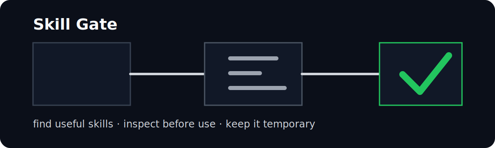

# Skill Gate

A skill wants into your agent. Skill Gate checks its ID.


0 to 3 picks | real install counts | pinned commits | temporary by default

Your agent is about to load a stranger's instructions.

Maybe that skill is excellent. Maybe it has five installs, a shell script, a stale repo, and a line that says "ignore previous instructions."

Skill Gate stands at the door.

It asks:

```text
Does this task need an outside skill?
Is this the smallest useful set?
Do real people use it?
What files and scripts are inside?
Did the user approve it?
Can we delete it cleanly afterward?
```

If the answer is boring, Codex keeps working alone. Boring is the win.

## Before / After

You ask:

```text
Build a polished React admin dashboard.
```

Without a gate, an agent can collect skills like keychains: React, typography, accessibility, dashboard, testing, design, docs. More instructions. More overlap. More ways to be wrong.

With Skill Gate:

```text
Recommended skills
1. vercel-labs/agent-skills@vercel-react-best-practices
   Installs: 497,300
   Fit: 100/100; Trust: 90/100
   Quality: publisher vercel-labs; updated 2026-06-15; license MIT; archived No
   Resolver: OK
   Next: skill-gate inspect vercel-labs/agent-skills@vercel-react-best-practices
```

Then it opens the package before Codex trusts it:

```text
Pinned commit: f8a72b9603728bb92a217a879b7e62e43ad76c81
Fit: 75/100
Trust: 45/100
Risk: 90/100
Maintenance: 70/100
Verdict: Reject for use; view-only.
Executable scripts: No
Environment variables: Yes
Risk: HIGH
```

No approval, no load.

## The Rule

Use a skill only when it buys real capability:

```text
1. Ordinary coding task?        Codex only.
2. Specialized workflow?        Search.
3. Too many overlapping skills? Keep the broad one.
4. No install count?            Treat it as unknown.
5. Scripts or secrets?          Slow down.
6. User did not approve?        Stop.
7. Task done?                   Ask before cleanup.
```

Skill Gate is lazy in the useful way: it tries to prevent work, not create a marketplace.

## Install

```powershell
git clone https://github.com/lu666by/skill-gate.git
cd skill-gate
npm install
npm test
```

For Codex, install it as a local plugin from this checkout. The plugin carries the workflow skill; the CLI does the boring filesystem, GitHub, audit, manifest, and cleanup work.

## Commands

Local checkout examples use `node dist/src/cli.js <command>`. If the package bin is linked or globally installed, `skill-gate <command>` is equivalent.

| Command | What it does |
|---|---|
| `recommend "<task>"` | Search real skill sources, filter GitHub metadata, dry-run resolver, and return 0 to 3 candidates. |
| `inspect <source> [--task "<task>"]` | Copy or clone a skill into `.skill-gate/sessions/<id>/`, audit it, and show a decision page. |
| `use <source> --approve` | Consume the inspected pinned session for one temporary use. |
| `view <source>` | Download for review without approval. |
| `install <source> --approve` | Keep the inspected pinned files in this project. |
| `upgrade <source>` | Inspect the latest remote version and report whether it changed. |
| `apply <source> --approve` | Apply the latest inspected copy to this project. |
| `delegate "<task>"` | Produce a multi-agent split plan without spawning agents or touching files. |
| `status` | Show temporary sessions and approval state. |
| `pack [name]` | Save current sessions as a reusable pack. |
| `cleanup [--approve]` | Preview, then delete only manifest-owned paths inside `.skill-gate` with approval. |
| `diff <source>` | Compare the pinned commit with current remote HEAD and show file stat when available. |

Sources can be local paths, `owner/repo@skill`, `owner/repo@skill#<40-hex-commit>`, GitHub repo URLs, or GitHub tree URLs such as `https://github.com/org/repo/tree/main/path/to/skill`.

## Risk

| Risk | Meaning | V1 behavior |
|---|---|---|
| LOW | Static `SKILL.md` and references. No scripts, secrets, or outside writes. | Can be used once after approval. |
| MEDIUM | Network instructions or templates, but no automatic execution. | Show the summary first. |
| HIGH | Scripts, install hooks, symlinks, shell, env/secrets, global config, deletes, outside writes, or prompt injection. | View-only. No script execution. |

## What It Is Not

Not a skill store.

Not a permanent installer by default.

Not MCP yet. MCP is for shared tools and services. V1 is a plugin plus a local CLI because the first problem is trust, not transport.

```text
Plugin = product
Skill  = decision workflow
CLI    = search, inspect, pin, approve, clean up
MCP    = later
```

Chinese usage notes: [USAGE.md](USAGE.md).

## Development

```powershell
npm test
```

The test is small on purpose: parser, metadata filters, resolver boundaries, thresholds, delegation, dedupe, risk scan, one-time use, pack, session, and cleanup guards.

## License

[MIT](LICENSE). Short enough.
